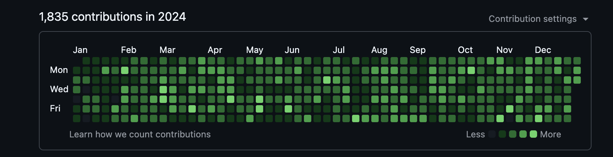
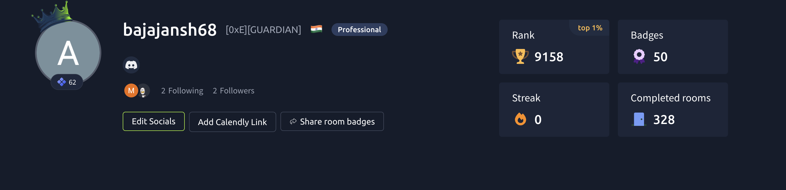

<h1 align="center">
    
</h1>

<h3 align="center">
B.Tech Computer Science Engineering (Cybersecurity) Student 🇮🇳
</h3>

<p align="center">
Passionate about Cybersecurity, Ethical Hacking, Software Development & Artificial Intelligence
</p>

<br/>

<div align="center">

🔐 Exploring **Offensive Security, Vulnerability Research & Threat Intelligence**

💻 Building secure applications using **React, Node.js, Spring Boot & Python**

🛡️ Learning **Penetration Testing, Malware Analysis, Cloud Security & SOC Operations**

🌱 Currently improving my skills in **TypeScript, AI Security & Advanced Cyber Defense**

🎯 Career Goal: Become a skilled **Cybersecurity Engineer**

</div>

<br/>

---

## 🌐 Connect With Me

<div align="center">

[](https://linkedin.com/in/akshay-bajaj-11484727b)

[](https://github.com/Akshaybajaj78)

[]([https://tryhackme.com](https://tryhackme.com/p/bajajansh68))

[](https://x.com/bajajansh68)

</div>

---

# 👨‍💻 About Me

```yaml
name: Akshay Bajaj
education: B.Tech Computer Science Engineering (Cybersecurity)
location: India

interests:
  - Ethical Hacking
  - Penetration Testing
  - Malware Analysis
  - Network Security
  - Cloud Security
  - Artificial Intelligence Security

currently_learning:
  - Advanced Web Security
  - Threat Detection
  - Security Automation
  - Secure Software Development

tools:
  - Kali Linux
  - Burp Suite
  - Nmap
  - Wireshark
  - Metasploit
```

---

# 🛡️ Cybersecurity Arsenal

<p align="center">


</p>

---

# 💻 Development Stack

### Languages

<p align="center">


</p>


### Web Development

<p align="center">


</p>


### Cloud & Tools

<p align="center">


</p>

---

# 🏆 Certifications & Learning

- 🔐 TryHackMe Jr Penetration Tester
- 🛡️ Google Cybersecurity Professional Certificate
- ☁️ Cloud Security Fundamentals
- 🚩 Advent of Cyber Participant
- 🧪 Web Application Security Labs

---

# 📚 Currently Exploring

```text
🔥 Offensive Security
🔥 Malware Reverse Engineering
🔥 AI in Cybersecurity
🔥 Cloud Security Architecture
🔥 Security Automation
🔥 Threat Hunting
```

---
# 📊 GitHub Stats

<p align="center">


</p>

---

# 🐍 Contribution Snake

<p align="center">

  

</p>

---

<div align="center">

### "Security is a journey of continuous learning." 🔐

⭐ Always learning. Always building. Always improving.

</div>


# 🛡️ TryHackMe Profile

<p align="center">
  
</p>

<p align="center">
  🔥 Completed 300+ rooms | 🏆 Top 1% Rank | 🎖️ 50+ Badges
</p>

